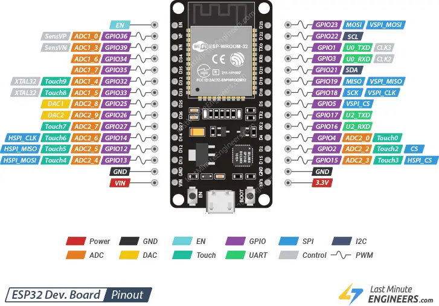

# AITRIP 30-Pin ESP32 Wiring

This project targets the **AITRIP 30-pin CP2102 ESP-WROOM-32 USB-C** board ([Amazon B0CR5Y2JVD](https://www.amazon.com/dp/B0CR5Y2JVD)).

| Spec | Value |
|---|---|
| Module | ESP-WROOM-32 / ESP-32D |
| Flash | 4 MB |
| USB | USB-C |
| USB-serial | CP2102 |
| Header | **30 pins** — 15 per side |

Pin assignments for the bingo flashboard are in `include/config.h`.



> Pinout verified against the [AITRIP Amazon listing](https://www.amazon.com/dp/B0CR5Y2JVD) silkscreen ([source diagram](https://github.com/VanceVagell/kv4p-ht/issues/59#issuecomment-2439999999)). **Use the labels printed on your board**, not generic ESP32 diagrams — this layout differs from 38-pin DevKitC boards.

## Power

| Connection | Silkscreen | Side | Notes |
|---|---|---|---|
| **USB-C** | — | Bottom edge | Primary power + programming |
| **Common GND** | `GND` | Left or right, 14th pin down | Tie to 12V (−) and strip GND |
| **3V3 out** | `3V3` | Right, bottom pin | 3.3V regulated output — not for the strip |
| **VIN** | `VIN` | Left, bottom pin | 5V input when not using USB |
| **12V (+)** | — | — | **Never** connect to ESP32 header pins |

## Bingo connections (use silkscreen labels)

| Function | GPIO | **Silkscreen** | Side | Connect to |
|---|---|---|---|---|
| **LED data** | **4** | **`D4`** | Right | WS2811 strip **DIN** |
| **Button 1** | **16** | **`RX2`** | Right | Momentary switch → **GND** |
| **Button 2** | **17** | **`TX2`** | Right | Momentary switch → **GND** |
| **Status LED** | **2** | **`D2`** | Right | Onboard LED (no wire) |
| **Ground** | — | **`GND`** | Left or right | 12V (−) + strip GND |

Firmware uses **internal pull-ups** on the buttons.

### Button actions (firmware)

| Button | Silkscreen | GPIO | Short press | Long press |
|---|---|---|---|---|
| **Button 1** | `RX2` | 16 | Cycle game type (pre-game / during winner) | Reset game (during active game) |
| **Button 2** | `TX2` | 17 | Draw next number (automatic mode only) | Winner / keep-going flow |

## WS2811 strip (105 LEDs, 12V)

```
12V supply (+)  ──────────────────────►  Strip +12V / VCC
12V supply (−)  ──┬──────────────────►  Strip GND
                  │
ESP32 GND         ┘  (either GND header pin)
ESP32 D4 (GPIO 4) ──────────────────────►  Strip DIN
```

- **105 LEDs** total (80 flashboard + 25 game-type matrix).
- Color order: **RGB** (WS2811), set by `LED_COLOR_ORDER` in `include/config.h`.
- A **3.3V → 5V level shifter** on the data line is recommended for 12V strips.

## Pin diagram (matches board silkscreen, USB at bottom)

Read **top → bottom** on each side. This is the layout on the AITRIP B0CR5Y2JVD board — not the generic espboards.dev 30-pin chart.

```
                    ┌─────────────────────┐
               EN  ─┤                     ├─ D23
               VP  ─┤                     ├─ D22
               VN  ─┤                     ├─ TX0   ◄── GPIO 1 — USB serial, avoid
              D34  ─┤                     ├─ RX0   ◄── GPIO 3 — USB serial, avoid
              D35  ─┤   ESP-WROOM-32      ├─ D21
              D32  ─┤                     ├─ D19
              D33  ─┤                     ├─ D18
              D25  ─┤                     ├─ D5
              D26  ─┤                     ├─ TX2   ◄── BUTTON 2 (GPIO 17) ──► GND
              D27  ─┤                     ├─ RX2   ◄── BUTTON 1 (GPIO 16) ──► GND
              D14  ─┤                     ├─ D4    ◄── LED DATA (GPIO 4)
              D12  ─┤                     ├─ D2    ◄── status LED (GPIO 2)
              D13  ─┤                     ├─ D15
              GND  ─┤                     ├─ GND   ◄── tie to 12V (−) & strip GND
              VIN  ─┤                     ├─ 3V3
                    └─────────────────────┘
                    [EN btn] [USB-C] [BOOT btn]
```

### Quick wiring cheat sheet

```
Either GND pin     ──────► 12V supply (−) and strip GND
Right: D4          ──────► strip DIN
Right: RX2         ──────► Button 1 ──► GND
Right: TX2         ──────► Button 2 ──► GND
Right: D2          ────── onboard blue LED (firmware status)
```

All four bingo signals are on the **right-hand header**, in the lower half (`TX2` → `D2`).

## Pins to avoid

| Silkscreen | GPIO | Reason |
|---|---|---|
| `TX0` / `RX0` | 1, 3 | CP2102 USB UART |
| `D15` | 15 | Boot strapping pin |
| `D12` | 12 | Boot strapping pin |
| `D5` | 5 | Boot strapping pin |
| `VP`–`D35` | 36, 39, 34, 35 | Input-only, no pull-up/down |
| *(not on header)* | 0 | Boot — use onboard **BOOT** button to flash |

GPIO 6–11 and GPIO 9 are **not broken out** on this 30-pin board.

## Onboard controls & LEDs

| Item | Notes |
|---|---|
| **USB-C** | Power + programming |
| **CP2102** | USB-serial chip (square IC near USB port) |
| **EN button** | Hardware reset |
| **BOOT button** | Hold while pressing EN to enter flash mode (GPIO 0) |
| **Red power LED** | On when USB powered |
| **Blue LED** | GPIO 2 (`D2` header pin) — firmware status |

If the blue LED polarity seems inverted, set `STATUS_LED_ACTIVE_LOW` to `1` in `include/config.h`.

## PlatformIO target

```ini
board = esp32dev   ; AITRIP 30-pin CP2102 ESP-WROOM-32 (4 MB flash)
```

```bash
pio run -e esp32dev --target upload
pio run -e esp32dev --target uploadfs
```

## Not this board?

The **38-pin** ESP32 DevKitC uses a different header order (`3V3` top-left, `EN` second pin, `IO4`/`IO16`/`IO17` in different positions). GPIO numbers for this project are the same (4, 16, 17, 2) but **silkscreen positions differ** — always wire by the label printed next to the pin.
